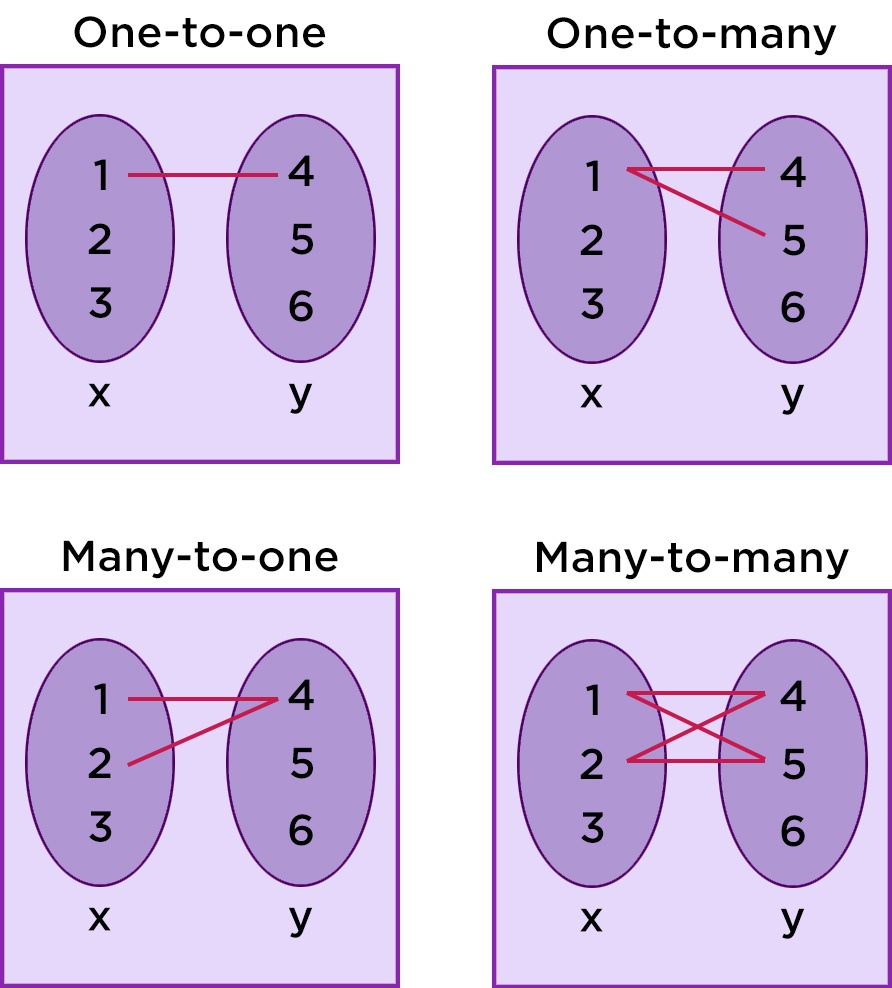

# Related Resources and Integration Testing
## Working with Relationships in Spring Data REST
We use the H2 embedded database to implement : 
- One-to-One Relationship
- One-to-Many Relationship
- Many-to-Many Relationship
  

## 
We can test our project using `TestRestTemplate` / we'll need the latest junit-jupiter-engine, junit-jupiter-api, and Spring test dependencies