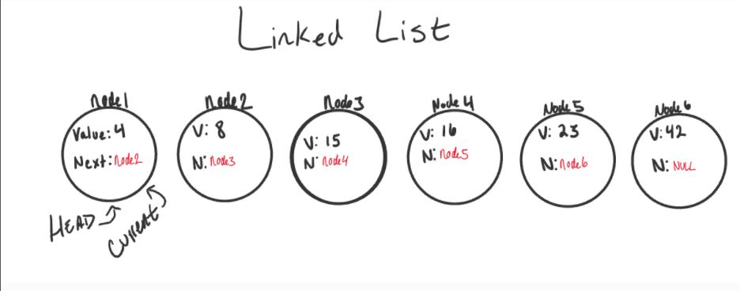

#  Linked Lists

## Big O: Analysis of Algorithm Efficiency

The stament is used to describe Big O is its used to describe the efficiency of an algorithm or function based in two things : 

- Running Time
- Memory Space

Its descibe the `Worst Case` of efficiency in your code . 

## Linked Lists

Multiple node that connected to each other and each note referance to next node. 

There are two types of Linked : 

- Singly 
- Doubly

Singly Linked liked : 

### Traversal 
When we use traversal we depend on next we can't used foreach and for loop the best way is to used while with next ... 

    ALGORITHM Includes (value)
    // INPUT <-- integer value
    // OUTPUT <-- boolean

    Current <-- Head

    WHILE Current is not NULL
        IF Current.Value is equal to value
        return TRUE

        Current <-- Current.Next

    return FALSE