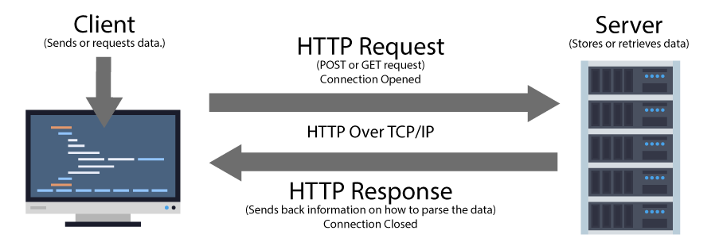

# WRRC and Java
## HTTP Request Lifecycle
- The browser get the host name , port number , resource and query string . 
- The DNS resolve IP 
- Establish a TCP Connection
- Send request 
- Once the server receives the request, processes it, and finds the resource being requested, it generates an HTTP response.
  
- 