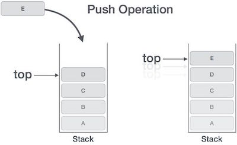

# Stacks and Queues
## What is stack 
The stack is  data structure all of nodes each nodes have a connection with the next node.

Push - Nodes or items that are put into the stack are pushed
Pop - Nodes or items that are removed from the stack are popped.

Push
Pushing a Node onto a stack will always be an O(1) operation.

