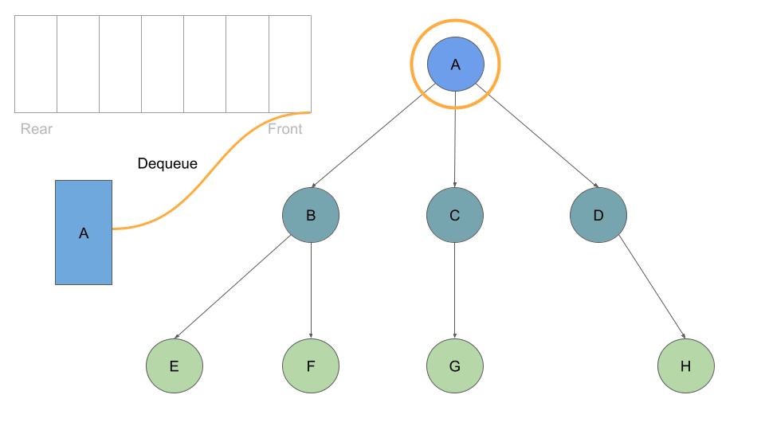

# Trees
## Traversals
Traversing a tree allows us to search for a node , here are two categories of traversals : 
- Depth First
- Breadth First

### Depth First
Prioritize going through the depth (height) of the tree first.

## Breadth First
Traversal iterates through the tree by going through each level of the tree node-by-node.

## Binary Tree Vs K-ary Trees
Binary Trees restrict the number of children to two while K-ary Trees are able have more than 2 child nodes.

