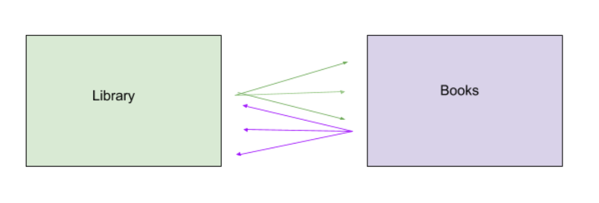

# Web App Security

## Hibernate Many to Many
A many-to-many relationship occurs when multiple records in a table are associated with multiple records in another table.

## SQL injection
SQL injection, also known as SQLI, is a common attack vector that uses malicious SQL code for backend database manipulation to access information that was not intended to be displayed. This information may include any number of items, including sensitive company data, user lists or private customer details.

