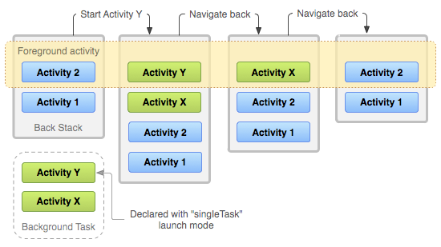

# Intents, Activities, and SharedPreferences

## Tasks and the back stack
A task is a collection of activities that users interact with when trying to do something in your app. The task arrange in a stack

### Lifecycle of a task and its back stack

The device Home screen is the starting place for most tasks. When a user touches the icon for an app or shortcut in the app launcher (or on the Home screen), that app's task comes to the foreground.

When the current activity starts another, the new activity is pushed on the top of the stack and takes focus. The previous activity remains in the stack, but is stopped. 

The back stack operates as a last in, first out object structure

## Manage tasks

The way Android manages tasks and the back stack, as described above—by placing all activities started in succession in the same task and in a last in, first out stack—works great for most apps and you shouldn't have to worry about how your activities are associated with tasks or how they exist in the back stack.

## Save key-value data 
If you have a relatively small collection of key-values that you'd like to save, you should use the `SharedPreferences` APIs. A `SharedPreferences` object points to a file containing key-value pairs and provides simple methods to read and write them. 

### Get a handle to shared preferences

- getSharedPreferences()
- getPreferences()

