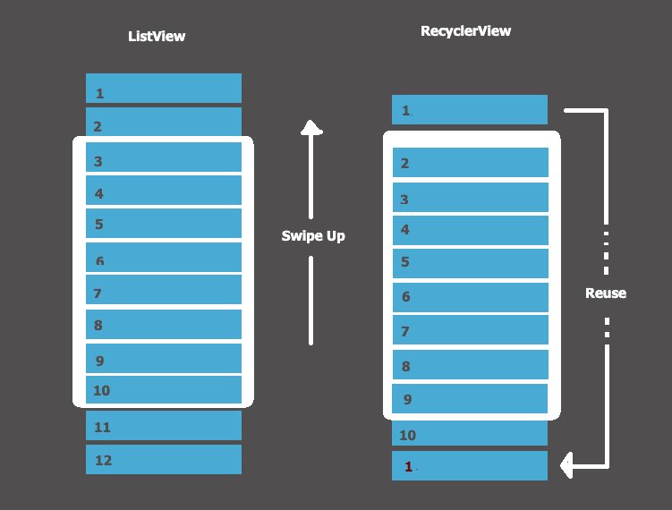

# RecyclerView
To display large set of data we can use recycler view  , RecyclerView recycles those individual elements. When an item scrolls off the screen, RecyclerView doesn't destroy its view. Instead, RecyclerView reuses the view for new items that have scrolled onscreen.

## Steps for implementing your RecyclerView

- First, you can start from list or grid. Ordinarily you'll be able to use one of the RecyclerView library's standard layout managers.
- You can design how each element in the list is going to look and behave. 
- Define the Adapter that associates your data with the ViewHolder views.

## Plan your layout

LayoutManager can arrange your RecyclerView item  , The RecyclerView library provides three layout managers : 

- LinearLayoutManager
- GridLayoutManager
- StaggeredGridLayoutManager

