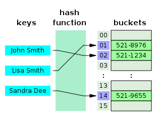

# Hashtables

## What is a Hashtable?
Hashtables are a data structure that utilize key value pairs 

## What is a hash ? 
Hashing is a technique that is used to uniquely identify a specific object from a group of similar objects

## Structure

### Hashing
A hash convert the key into an integer , Hash codes should never have randomness to them. The same key should always produce the same hash code.

### Collisions

A collision occurs when more than one key hashes to the same index in an array . 

Collisions are solved by changing the initial state of the buckets. Instead of starting them all as null we can initialize a LinkedList in each one! Now if two keys resolve to the same index in the array then their key/value pairs can be stored as a node in a linked list. 

## Bucket Sizes

If a hash map has only a few buckets it will be densely full and have many collisions. If a hash map has more buckets it will be more sparsely populated, there will be less collisions, but there may be a lot of extra empty space.

The `load factor` tells us something about how full the hash table is. A hash table can start with only a few buckets, calculate it’s own load factor, recognize when it gets too full and automatically grow and add more buckets to itself to accommodate more data.

