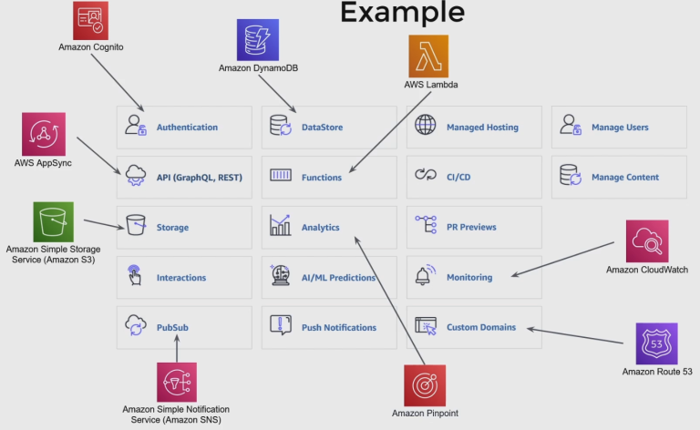

# AWS Amplify

## What is AWS Amplify?
AWS Amplify is a powerful toolkit developers use to build full stack applications that directly integrate with the cloud It helping you integrate with other AWS services

he main strength of Amplify is that it quickly lets you add thigs like : 
- Storage 
- Authentication 
- Monitoring 
- PubSub functionalities.

## An Example Of Amplify Features

## Pros and Cons of Amplify

