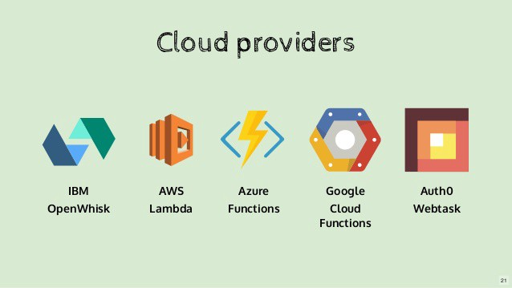
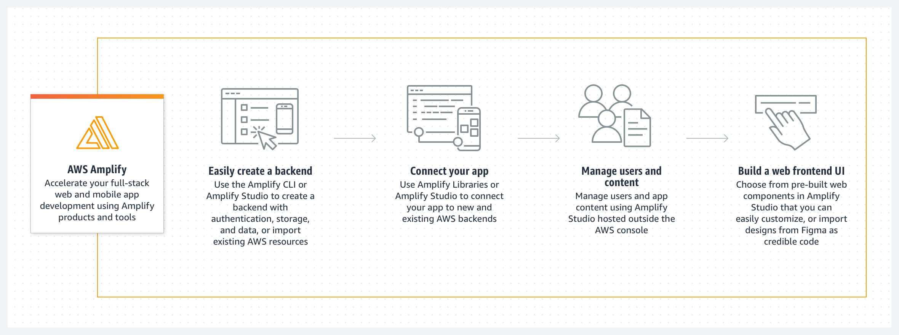

# Serverless and Amplify
## What is Serverless Architecture?

Serverless is a cloud computing execution model where the cloud provider dynamically manages the allocation and provisioning of servers.
Here are some of the currently available cloud services : 

## Traditional vs. Serverless Architecture

## AWS Amplify
AWS Amplify is a set of purpose-built tools and features that lets frontend web and mobile developers quickly and easily build full-stack applications on AWS, with the flexibility to leverage the breadth of AWS services as your use cases evolve. 

## API (GRAPHQL)
### Data modeling
Amplify automatically creates Amazon DynamoDB database tables for GraphQL types annotated with the `@model` . You can create relations between the data models via the @hasOne, @hasMany, @belongsTo, and @manyToMany directives.