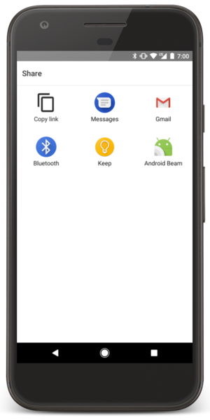

# Notifications

## Intent Filters
If your app can perform an action that might be useful from another app, your app should be prepared to respond to action requests by specifying the appropriate intent filter in your activity.

When you  support the ACTION_SEND intent. Then, when users initiate a "share" action from another app, your app appears as an option . 

To allow other apps to start your activity in this way, you need to add an <intent-filter> element in your manifest file such that : 

    <activity android:name="ShareActivity">
        <intent-filter>
            <action android:name="android.intent.action.SEND"/>
            <category android:name="android.intent.category.DEFAULT"/>
            <data android:mimeType="text/plain"/>
            <data android:mimeType="image/*"/>
        </intent-filter>
    </activity>

## Handle the Intent in Your Activity 

    @Override
    protected void onCreate(Bundle savedInstanceState) {
    super.onCreate(savedInstanceState);
    
        setContentView(R.layout.main);
    
        // Get the intent that started this activity
        Intent intent = getIntent();
        Uri data = intent.getData();
    
        // Figure out what to do based on the intent type
        if (intent.getType().indexOf("image/") != -1) {
            // Handle intents with image data ...
        } else if (intent.getType().equals("text/plain")) {
            // Handle intents with text ...
        }
    }

## Intent types

### Explicit intents
- You'll typically use an explicit intent to start a component in your own app . 

### Implicit intents
- Implicit intents instead declare a general action to perform, which allows a component from another app to handle it.